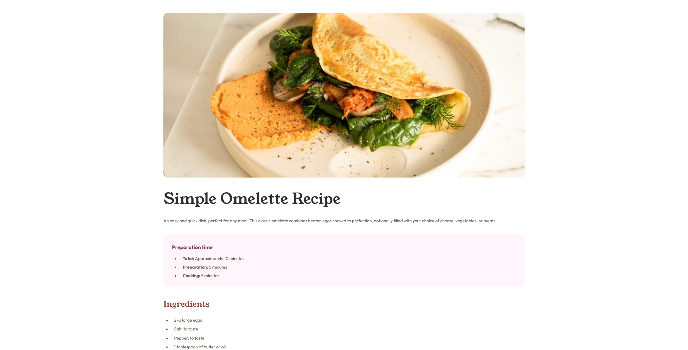

# Frontend Mentor - Recipe page solution

This is a solution to
the [Recipe page challenge on Frontend Mentor](https://www.frontendmentor.io/challenges/recipe-page-KiTsR8QQKm).
Frontend Mentor challenges help you improve your coding skills by building realistic projects.

## Table of contents

- [Overview](#overview)
    - [Screenshot](#screenshot)
    - [Links](#links)
- [My process](#my-process)
    - [Built with](#built-with)
    - [What I learned](#what-i-learned)

- [Author](#author)
- [Acknowledgments](#acknowledgments)

## Overview

### Screenshot

### Links

- Solution URL: [Repository](https://github.com/Vincentvdt/FM-recipe-page-chall)
- Live Site URL: [Vercel](https://fm-recipe-page-chall.vercel.app/)

## My process

### Built with

- Semantic HTML5 markup
- CSS custom properties
- Flexbox
- Mobile-first workflow

### What I learned

I really have little to say here, and honestly, that goes for the whole project.
I mostly did it just to test things out.

However, I *did* discover the existence of the `<dl>`, `<dt>`, and `<dd>` elements.
I actually wanted to use them for the preparation time block, but I couldn’t get the design I wanted,  
so I gave up on that idea and went simpler instead.

## Author

- Website - [Vincentvdt](https://vincentvdt.fr)
- Frontend Mentor - [@Vincentvdt](https://www.frontendmentor.io/profile/Vincentvdt)

## Acknowledgments

Don’t overthink it. I probably did too much (and not enough, ironically) for a challenge like this.
Don’t hesitate to use the internet as your ally 👌 Stack Overflow has every answer you’ll ever need.
Start by following your gut, then circle back and ask yourself : how can I make this simpler or better?
And if you don’t know, ask the internet. gl!